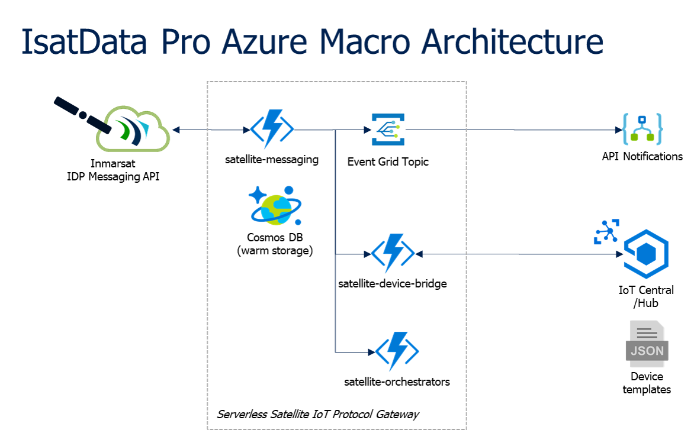
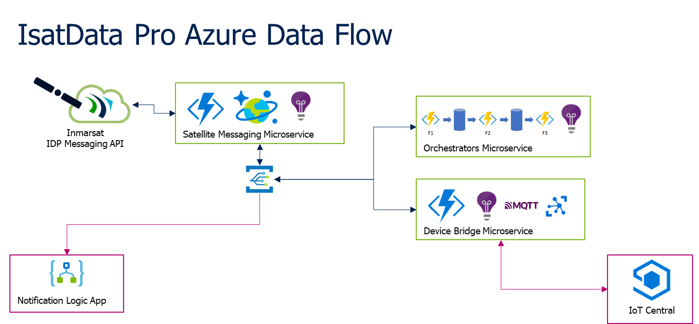

# Architecture Overview

> :warning: Work in Progress

## Macro Architecture

The architecture major building blocks are:

| Component | Technology | Description |
|---|---|---|
|Satellite API Client|Node.js [Azure Functions](https://azure.microsoft.com/en-gb/services/functions/)|A Function App that interfaces with the Inmarsat API for retrieving and submitting satellite messages. Forms part of the IoT Protocol Gateway.|
|IoT Hub/Central Device Bridge|Node.js [Azure Functions](https://azure.microsoft.com/en-gb/services/functions/)|A Function App that translates satellite messages to/from device data in IoT Central. Forms part of the IoT Protocol Gateway.|
|Durable Orchestrators|Node.js [Durable Functions](https://docs.microsoft.com/en-gb/azure/azure-functions/durable/durable-functions-overview?tabs=javascript)|OtaCommand manages the progression of forward messages triggered by the device bridge through to completion of responses via satellite. Forms part of the IoT Protocol Gateway.|
|Warm Storage|[Azure Cosmos DB](https://docs.microsoft.com/en-us/azure/cosmos-db/introduction)|Provides warm storage for the various satellite API interactions including access credentials, relationships, message/data history and API call logs.|
|Event Emitter|[Event Grid Topic](https://docs.microsoft.com/en-gb/azure/event-grid/overview)|A custom topic to externalize messages and other framework events for inter-service communication and as part of the IoT Protocol Gateway.|
|Event Subscribers|Azure Functions & [Logic Apps](https://azure.microsoft.com/en-ca/services/logic-apps/)|Several Event Grid topic subscribers listen to the topic events to provide multi-process capability of a externalized messages and API events.|
|Data & Device Visualization|[Azure IoT Central](https://azure.microsoft.com/en-ca/services/iot-central/)|A hosted IoT application platform that can represent device models and telemetry based on the creation of templates.|

The following are the Event Grid subscribers:

| Subscriber | Technology | Description |
|---|---|---|
|Notification|[Logic App](https://azure.microsoft.com/en-ca/services/logic-apps/)|Notifies a system administrator if any outage (or recovery) of the satellite API host is detected.|
|Satellite API Client|Node.js [Azure Functions](https://azure.microsoft.com/en-gb/services/functions/)|Forwards command messages to remote satellite devices, or updates API configuration parameters in the database.|
|Device Bridge|Node.js [Azure Functions](https://azure.microsoft.com/en-gb/services/functions/)|Translates messages received from satellite devices into telemetry and properties used by IoT Central.|
|Durable Orchestrator|Node.js [Durable Functions](https://docs.microsoft.com/en-gb/azure/azure-functions/durable/durable-functions-overview?tabs=javascript)|Progresses remote command operations used by IoT Central via the device bridge.|

## Microservices-based Azure IoT Protocol Gateway

Inmarsat's IsatData Pro service provides a REST-based API for communicating with 
remote IoT devices and gateways via satellite messaging.  Since the Inmarsat API 
is based on polling, we need to implement a Protocol Gateway to communicate with 
Azure IoT Hub/Central.  Inmarsat provides an open source sample library for 
microservices based on Node.js that provided AgriGrow a starting point but they 
did not want to deploy their own server and database infrastructure.

Although Microsoft provides a sample 
[Azure IoT Protocol Gateway](https://docs.microsoft.com/en-us/azure/iot-hub/iot-hub-protocol-gateway),
that implementation is designed for a hosted Cloud Services deployment and not 
readily compatible with our design objective of using Javascript/Node.js as a 
common programming language.  So we have chosen to implement a protocol gateway 
as a collection of Function Apps within our serverless microservices framework.

Our protocol gateway is made up of the following components that interface to 
the Inmarsat **IsatData Pro Messaging API**:

* A *Cosmos DB* provides storage for various aspects of the API interface 
including:

  * **Satellite Gateway** (API host) details
  * **Mailbox** credentials and API host association
  * **Mobile** metadata
  * **Message** history
  * **API Call Logs** with metadata used for maintaining a polling high water 
  mark

* A *Function App* [**satellite-messaging**](https://github.com/Inmarsat/isatdatapro-azure/tree/master/satellite-messaging) makes API calls to the satellite host, and publishes 
various events related to messaging or device metadata.

* A *Function App* [**device-bridge**](https://github.com/Inmarsat/isatdatapro-azure/tree/master/device-bridge)
implements a data translation framework for Azure **IoT Central** based on 
device templates.

* A *Function App* [**orchestrators**](https://github.com/Inmarsat/isatdatapro-azure/tree/master/orchestrators)
manages remote commands and configuration of device properties as a chained 
function workflow.

* A *Logic App* [**notifications**](https://github.com/Inmarsat/isatdatapro-azure/tree/master/notifications)
handles notifications related to API outages and recovery, emailing a contact.

## IoT Central Data Visualization

For speed/ease of implementation we chose to use **IoT Central** for 
visualization and device management rather than implementing custom APIs and 
Web application(s).

An integrator or device manufacturer creates a 
[device twin](https://docs.microsoft.com/en-us/azure/iot-hub/iot-hub-devguide-device-twins) 
template that includes the Inmarsat-provided **idpmodem.json** interface 
definition.

>: Note: Currently these templates are stored within the device bridge function
app storage `/lib/deviceTemplates`. A future improvement will store these 
templates in a database.

The device bridge auto-registers new devices using the unique IDP Mobile ID as 
part of the device name. An IoT Central user can then provision/migrate new 
devices to the relevant device template (which are pushed by the device bridge).

However since the satellite IoT messaging is not IP connection oriented, we need 
to make a few design compromises to work around the constraints of IoT Central:

* **Commands** cannot easily be implemented since they rely on always-connected 
devices, so instead we create **writable properties** and dashboard forms to 
manage those properties as command proxies.

* **Satellite Gateway** and **Mailbox** entities in the Cosmos DB are modeled as 
devices using **device templates**.  But these entities should not be considered 
as true devices (nor gateways) rather a proxy for configuring the API database.

## Data Flow

The Event Grid Topic acts as the central exchange for inter-service 
communication.

### Mobile-Originated data (Telemetry, Reported Properties)

The **satellite-messaging** microservice runs a timer-driven function 
*MessageReturnGet* that continually polls the Inmarsat API for new *Return* 
messages generated by remote devices.  Each message is stored in the Cosmos DB 
and is published to the Event Grid Topic.

The **satellite-device-bridge** function *DeviceToCloudBridge* is triggered by 
each *NewReturnMessage* event, and looks up the device template to transform the 
message data into the relevant *Telemetry* and *Reported Properties* used by the 
IoT Hub component of IoT Central. The device bridge then establishes a 
connection to Hub/Central using Device Provisioning Service via MQTT to push the 
relevant combination of new device template, new device and new 
telemetry/properties.

**IoT Central** receives new device templates and data pushed by the device 
bridge. A user can assign/migrate the new device to a device template which 
displays the data based on how the builder has defined the Views.

### Mobile-Terminated data (Desired Properties, Commands)

In **IoT Central** a builder has configured a View that allows a user to set 
Desired Properties, which are defined in a device template stored within the 
satellite-device-bridge function app. Commands are configured as boolean 
writable properties in the device template.

The **satellite-device-bridge** function *CloudToDeviceBridge* regularly 
connects to the IoT Central Hub to check for changes to Desired Properties, 
which it maps based on the device template to a particular *Forward* message. 
The device bridge then publishes a *CommandRequest* to the Event Grid Topic.

The **satellite-orchestrators** triggers on the *CommandRequest*, confirms 
that the requested command is not already in progress, and then starts the 
*OtaCommandOrchestrator*, which publishes a *NewForwardSubmission* event with a 
unique ID.

The **satellite-messaging** function *MessageForwardSubmit* is triggered by the 
*NewForwardSubmission* and sends the message to the remote device, publishing a 
*NewForwardMessage* event that is picked up by the orchestrator to map to the 
command request.  The messaging microservice continually polls the Inmarsat API 
for status updates on the forward message and publishes a 
*ForwardMessageStateChange*.

The **satellite-orchestrators** function *OtaCommandDelivery* triggers on the 
*ForwardMessageStateChange* to progress the orchestrator which, depending on the 
device template, will wait for any defined response *NewReturnMessage* before 
completing the command with a *OtaCommandResponse* event.

The **satellite-device-bridge** finally picks up any resulting report or 
response through the corresponding *NewReturnMessage* and/or 
*OtaCommandResponse* and updates IoT Central.

## Next Steps

Read more about [services intercommunication](services-intercommunication.md)