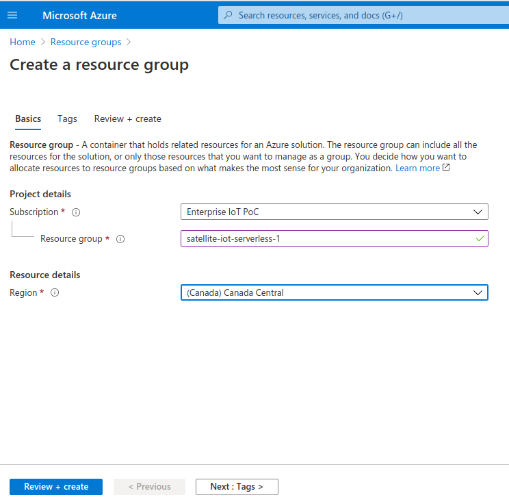
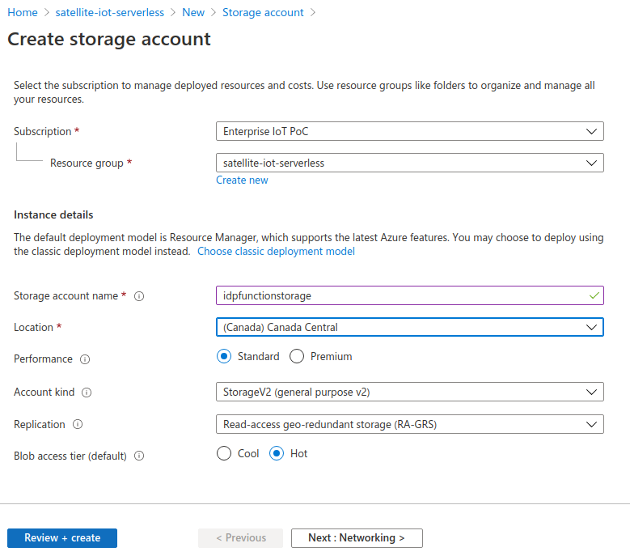
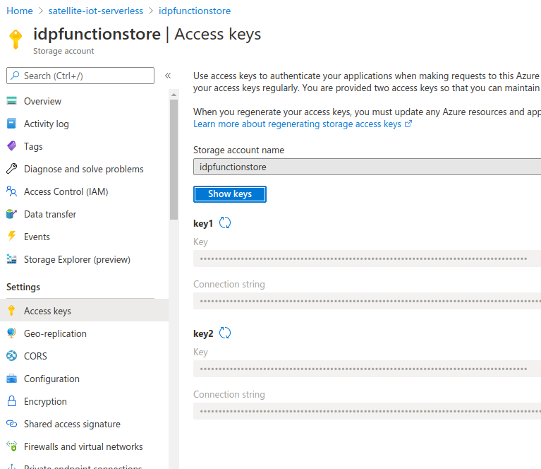
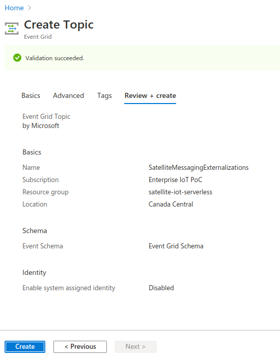
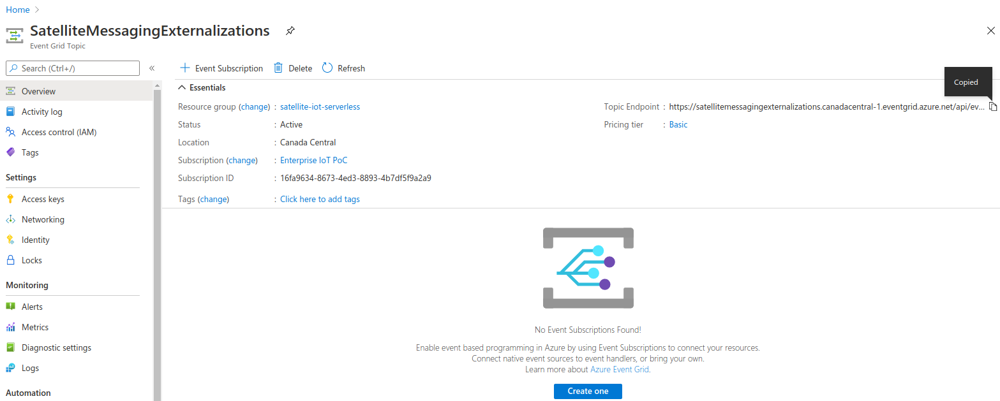
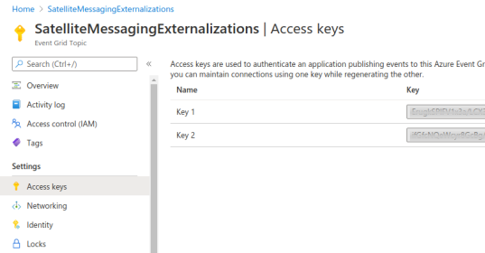
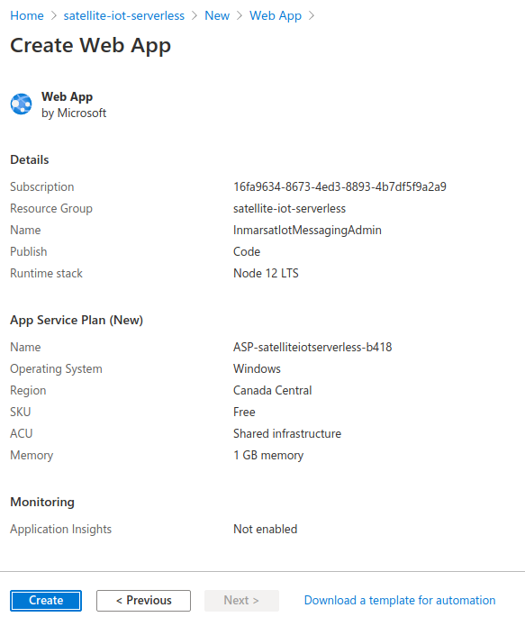
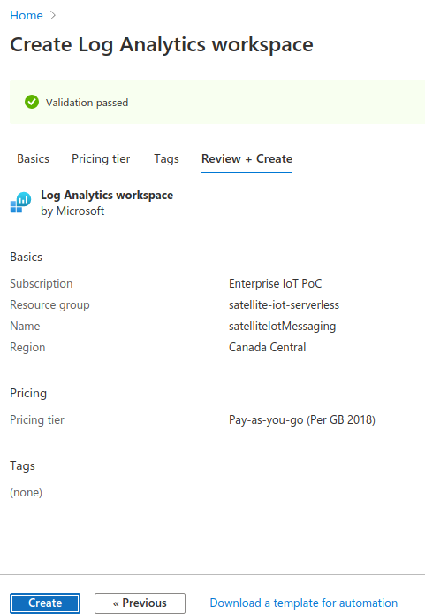
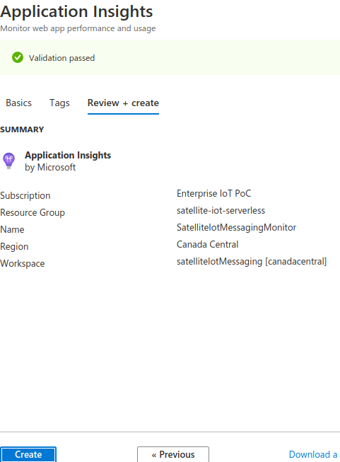
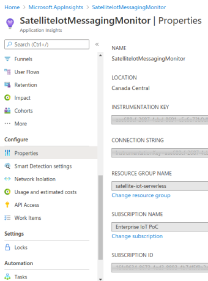

# Serverless Microservices reference architecture

In this document:

- [Serverless Microservices reference architecture](#satellite-iot-serverless-reference-architecture)
  - [Resources](#resources)
  - [Provision](#provision)
    - [Manual via the Portal](#manual-via-the-portal)
      - [Create the Resource Group](#create-the-resource-group)
      - [Create the Azure Cosmos DB assets](#create-the-azure-cosmos-db-assets)
      - [Create the Storage account](#create-the-storage-account)
      - [Create the Azure Function Apps](#create-the-azure-function-apps)
      - [Create the Event Grid Topic](#create-the-event-grid-topic)
      - **WORK IN PROGRESS BELOW THIS LINE**
      - [Create the Web App Service Plan](#create-the-web-app-service-plan)
      - [Create the Web App](#create-the-web-app)
      - [Create the Azure SQL Database assets](#create-the-azure-sql-database-assets)
      - [Create the Application Insights resource](#create-the-application-insights-resource)
      - [Create the API Management Service](#create-the-api-management-service)
      - [Create the SignalR Service](#create-the-signalr-service)
      - [Create Azure Key Vault](#create-azure-key-vault)
      - [Create the Azure AD B2C tenant](#create-the-azure-ad-b2c-tenant)
      - [Add Azure AD Graph API](#add-azure-ad-graph-api)
      - [Configure Azure AD B2C tenant](#configure-azure-ad-b2c-tenant)
      - [Create a sign-up or sign-in policy](#create-a-sign-up-or-sign-in-policy)
    - [Deploy from ARM template](#deploy-from-arm-template)
  - [Setup](#setup)
    - [Add APIM Products and APIs](#add-apim-products-and-apis)
      - [Drivers API](#drivers-api)
      - [Trips API](#trips-api)
      - [Passengers API](#passengers-api)
    - [Publish the RideShare APIM product](#publish-the-rideshare-apim-product)
    - [Retrieve the APIM API key](#retrieve-the-apim-api-key)
    - [Connect Event Grid to Function Apps](#connect-event-grid-to-function-apps)
    - [Connect Event Grid to Logic App](#connect-event-grid-to-logic-app)
    - [Create TripFact Table](#create-tripfact-table)
  - [Add secrets to Key Vault](#add-secrets-to-key-vault)
    - [Retrieving a secret's URI](#retrieving-a-secrets-uri)
  - [Function App Application Settings](#function-app-application-settings)
    - [Drivers Function App](#drivers-function-app)
    - [Passengers Function App](#passengers-function-app)
    - [Orchestrators Function App](#orchestrators-function-app)
    - [Trips Function App](#trips-function-app)
    - [Trip Archiver Function App](#trip-archiver-function-app)
  - [Configure your Function Apps to connect to Key Vault](#configure-your-function-apps-to-connect-to-key-vault)
    - [Create a system-assigned managed identity](#create-a-system-assigned-managed-identity)
    - [Add Function Apps to Key Vault access policy](#add-function-apps-to-key-vault-access-policy)
  - [Build the solution](#build-the-solution)
    - [Node.js](#nodejs)
    - [Web](#web)
      - [Create and populate settings.js](#create-and-populate-settingsjs)
      - [Compile and minify for production](#compile-and-minify-for-production)
      - [Create settings.js in Azure](#create-settingsjs-in-azure)
  - [Deployment](#deployment)
    - [Azure DevOps](#azure-devops)
      - [Prerequisites](#prerequisites)
      - [Create build pipelines](#create-build-pipelines)
      - [Create release pipeline](#create-release-pipeline)
      - [Import remaining two release pipelines](#import-remaining-two-release-pipelines)
    - [Cake Deployment](#cake-deployment)
  - [Seeding](#seeding)
  - [Containers](#containers)
    - [Docker Files](#docker-files)
    - [Docker Images](#docker-images)
    - [Running Locally](#running-locally)
    - [Running in ACI](#running-in-aci)
    - [Running in AKS](#running-in-aks)

## Resources

The following is a summary of all Azure resources required to deploy the solution:

| Prod Resource Name | Dev Resource Name | Type | Provision Mode |
|---|---|---|:---:|
| satellite-iot-serverless | satellite-iot-serverless-dev | Resource Group | Auto | 
| iotstoragewarm | iotstoragewarm-dev | Cosmos DB Account | Auto |
| IsatDataPro | IsatDataProDev | Cosmos DB Container | Auto |
| idpfunctionstore | idpfunctionstore-dev | Storage Account | Auto |
| *Location*Plan | *Location*Plan | App Service (Consumption) Plan | Auto |
| satelliteMessaging | satelliteMessagingDev | Function App | Auto |
| satelliteMessagingOrchestrators | satelliteMessagingOrchestratorsDev | Function App | Auto |
| satelliteMessagingDeviceBridge | satelliteMessagingDeviceBridgeDev | Function App | Auto |
| SatelliteMessagingExternalizations | SatelliteMessagingExternalizationsDev | Event Grid Topic | Manual |
| IdpApiNotifications | IdpApiNotificationsDev | Logic App | Manual |
| IdpAdminAppServicePlan | IdpAdminAppServicePlanDev | Web App Service Plan | Auto |
| IdpAdmin | IdpAdminDev | Web App Service | Auto |
| isatdatapro | isatdatapro-dev | Application Insights | Manual |
| idpadmin | N/A | API Management Service | Manual |
| IdpVault | IdpVaultDev | Azure Key Vault | Manual |

> :exclamation: **Please note** that, in some cases, the resource names 
must be unique globally. We suggest you append an identifier to the above 
resource names so they become unique i.e. `isatdatapro-xyzw`, etc.

## Provision

### Manual via the Portal

Log in to the [Azure portal](https://portal.azure.com).

#### Create the Resource Group

1.  Type **Resource** into the Search box at the top of the `All Services` 
page, then select **Resource Groups**  section.

2.  Click the **Add** button to create a new resource group.

3.  Complete the resource group creation form with the following:

    1. **Name**: Enter a unique value for the **resource group** 
    e.g. `satellite-iot-serverless`.
    2. **Subscription**: Select your Azure subscription.
    3. **Location**: Select a region closest to you. Make sure you select the 
    same region for the rest of your resources.

    

#### Create the Azure Cosmos DB assets

1.  Type **Cosmos** into the Search box at the top of the `All Services` page, 
then select **Azure Cosmos DB**  section.

2.  Click the **Add** button to create a new Cosmos DB Account.

3.  Complete the resource group creation form with the following:

    1. **Subscription**: Select your Azure subscription.
    2. **Resource Group**: Select the Resource Group you created above, 
    such as `satellite-iot-serverless`.
    3. **Account Name**: Enter a unique ID for the **Cosmos DB Account**, 
    such as `iotstoragewarm`.
    4. **API**: Select `Core (SQL)`.
    5. **Location**: Select a region closest to you. Make sure you select the 
    same region for the rest of your resources.
    6. **Capacity mode** Select `Provisioned throughput`
    7. **Geo-Redundancy**: Disable.
    8. **Multi-region Writes**: Disable.

    

4.  Select **Review + Create**, then select **Create** on the review screen.

    **Please note** that this process of creating a Cosmos DB Account can take 
    between 5-10 minutes.

5.  Once Cosmos Database is online, open it and select **Data Explorer** on the 
left-hand menu.

6.  (Optional) Select **New Container** on the toolbar. In the Add Container 
form that appears, enter the following:

    1. **Database ID**: Select **Create new** and enter `IsatDataPro`.
    2. **Container Id**: Enter `Main`.
    3. **Partition key**: Enter `/category`.
    4. **Throughput**: Select `400`.

7.  (Optional) Repeat step 6 for a new container called `IsatDataProDev`

8.  Take note of the DB Account keys:

    

#### Create the Storage account

1.  Type **Storage** into the Search box at the top of the `All Services` page, 
then select **Storage accounts**  section.

2.  Click the **Add** button to create a new Storage Account.

3.  Complete the storage creation form with the following:

    1. **Name**: Enter a unique name for the **Storage Account** 
    e.g. `idpfunctionstore`.
    2. **Deployment Model**: Select `Resource Manager`.
    3. **Account Kind**: Select `Storage V2`.
    4. **Location**: Select a region closest to you. Make sure you select the 
    same region for the rest of your resources.
    5. **Subscription**: Select your Azure subscription.
    6. **Resource Group**: Select the resource group to which you have added 
    your other services, such as `satellite-iot-serverless`.
    7. **Replication**: Select `RA-GRS`

    

4.  Take note of the DB Account keys:

    

#### Create the Azure Function Apps

In this step, you will be creating several new Azure Function Apps in the Azure 
portal. There are many ways this can be accomplished, such as 
[Visual Studio Code](https://docs.microsoft.com/en-us/azure/azure-functions/functions-develop-vs-code), 
[Visual Studio](https://docs.microsoft.com/en-us/azure/azure-functions/functions-develop-vs), 
[Azure CLI](https://docs.microsoft.com/en-us/azure/azure-functions/functions-create-first-azure-function-azure-cli?tabs=bash%2Cbrowser&pivots=programming-language-javascript), Azure [Cloud Shell](https://docs.microsoft.com/en-us/azure/azure-functions/scripts/functions-cli-create-function-app-vsts-continuous),
[Azure Resource Manager (ARM) template](https://docs.microsoft.com/en-us/azure/azure-functions/functions-create-first-function-resource-manager?tabs=visual-studio-code%2Cazure-cli), 
and through the Azure portal.

Each of these Function Apps act as a hosting platform for one or more functions. 
In our solution, they double as microservices with each function serving as an 
endpoint or method. Having functions distributed amongst multiple function apps 
enables isolation, providing physical boundaries between the microservices, as 
well as independent release schedules, administration, and scaling.

1.  Log in to the [Azure portal](https://portal.azure.com).

2.  Type **Function App** into the Search box at the top of the page, then 
select **Function App** within the Marketplace section.

3.  Complete the function app creation form with the following:

    1. **Subscription**: Select your Azure subscription.
    2. **Resource Group**: Select the resource group to which you have added 
    your other services, such as `satellite-iot-serverless`.
    3. **Function App name**: Enter a unique value for the 
    **`satelliteMessaging`** function app.
    4. **Publish**: Select `Code`.
    5. **Runtime stack**: Select `Node.js`.
    6. **Version**: Select `10 LTS`.
    7. **Region**: Select a region closest to you. Make sure you select the 
    same region as the rest of your resources.
    8. Click **Next: Hosting >**
    9. **Storage Account**: Select the storage account created above e.g. 
    `idpfunctionstore`.
    10. **Operating System**: Select `Windows`.
    11. **Plan Type**: Select `Consumption (Serverless)`.
    12. Click **Next: Monitoring >**
    9. **Enable Application Insights**: Select `No`. We will create an 
    Application Insights instance later that will be associated with all of the 
    Function Apps and other services.

    

4.  Repeat the steps above to create the **satelliteMessagingOrchestrators** and 
**satelliteMessagingDeviceBridge** function apps.

    - Enter a unique value for the App name, ensuring it has the word **tbd** 
    within the name so you can easily identify it.
    - Make sure you enter the same remaining settings and select the storage 
    account you created in the previous step.

#### Create the Event Grid Topic

1.  Type **Event Grid Topic** into the Search box at the top of the 
`All Services` page, then select **Event Grid Topic**  in Marketplace.

2.  Complete the event grid topic creation form with the following:

    1. **Subscription**: Select your Azure subscription.
    2. **Resource Group**: Select the resource group to which you have added 
    your other services, such as `satellite-iot-serverless`.
    3. **Name**: Enter a unique value for the Event Grid **Topic** 
    i.e. `SatelliteMessagingExternalizations`.
    4. **Location**: Select a region closest to you. Make sure you select the 
    same region as the rest of your resources.
    5. Click the **Review + create** button.
    6. Once completed, click the resource group link, then click the Event Grid 
    Topic link.

    

3. Take note of the newly-created topic endpoint URL:

    

5. Take note of the newly-created topic key from Settings > Access Keys:

    

#### Create the IoT Central Application

1.  Type **IoT Central** into the Search box at the top of the `All Services` 
page, then select **IoT Central Application**  section.

2.  Click the **Create** button to create a new IoT Central Application.

3.  Complete the IoT Central Application creation form with the following:

    1. **Resource Name**: Enter a name for the application such as 
    `satellite-iot`.  The Application URL should complete automatically.
    2. **Subscription**: Select your Azure subscription.
    3. **Resource Group**: Select the resource group to which you have added 
    your other services, such as `satellite-iot-serverless`.
    4. **Pricing Plan**: Select `Standard 1`.
    5. **Template**: Select `Custom application`.
    6. **Location**: Select a location closest to you.

4. Click the **Create** button.

5. Once the creation is complete, go to the resource and click the 
**IoT Central Application URL**.

6. From the IoT Central Application, click **Administration**, then click 
**API tokens**, then click **Generate token** and complete the form:

    1. **Token name**: Enter a unique value e.g. `initial-token`.
    2. **Role**: Select `Administrator`.
    3. Click **Generate** then copy the token and save it in a secure location.

7. TBD create enrollment group and SAS key for device enrollment.

> :warning: **WARNING: WORK IN PROGRESS BELOW - DO NOT USE**

#### Create the Web App

1.  Type **Web App** into the Search box at the top of the `All Services` page, 
then select **Web App** from the Marketplace.

2.  Complete the app service creation form with the following:

    1. **Subscription**: Select your Azure subscription.
    2. **Resource Group**: Select the resource group to which you have added your other services, such as `satellite-iot-serverless`.
    3. **Name**: Enter a unique value for the i.e. `SatelliteMessagingAdmin`.
    4. **Runtime stack**: Choose a preferred Node version e.g. `Node 10 LTS`
    5. **Operating system**: Select preference i.e. Windows or `Linux`
    6. **App Service Plan**: Select existing or create a new Free Tier.
    7. **Application Insights**: Select `Off`.

    

3. Click the **Review + Create** button, then **Create**

#### Create a Log Analytics Workspace resource

1.  Type **Log Analytics** into the Search box at the top of the 
`All Services` page, then select **Application Insights**  from the Marketplace.

2.  Complete the Log Analytics workspace creation form with the following:

    1. **Subscription**: Select your Azure subscription.
    2. **Resource Group**: Select the resource group to which you have added 
    your other services, such as `satellite-iot-serverless`.
    3. **Name**: Enter a unique value e.g. `SatelliteIotMessaging`.
    4. **Region**: Select the same region as your other resources.

    

3. Click the **Review + Create** button, then **Create**

#### Create the Application Insights resource

1.  Type **Application Insights** into the Search box at the top of the 
`All Services` page, then select **Application Insights**  from the Marketplace.

2.  Complete the application insights creation form with the following:

    1. **Subscription**: Select your Azure subscription.
    2. **Resource Group**: Select the resource group to which you have added 
    your other services, such as `satellite-iot-serverless`.
    3. **Name**: Enter a unique value e.g. `SatelliteMessagingMonitor`.
    4. **Resource mode**: Use the default `Workspace-based`.
    5. **Log analytics workspace**: Select the workspace created in the prior 
    steps.

    

3. Click the **Review + Create** button, then **Create**

4. Take note of the newly-created resource instrumentation key:

    

#### Create the API Management Service

1.  Type **API Management** into the Search box at the top of the `All Services` page, then select **API Management**  section.

2.  Click the **Add** button to create a new API Management service.

3.  Complete the API Management service creation form with the following:

    1. **Name**: Enter a unique value for the APIM Service i.e. `rideshare`.
    2. **Subscription**: Select your Azure subscription.
    3. **Resource Group**: Select the resource group to which you have added your other services, such as `satellite-iot-serverless`.
    3. **Location**: Select a region closest to you. Make sure you select the same region for the rest of your resources.
    5. **Organization name**: Type in your organization name.
    6. **Administrator email**: Type in an admin email.
    7. **Pricing tier**: Select `Developer (No SLA)`.

    

#### Create the SignalR Service

1.  Click **Create a resource** and type **SignalR** into the Search box, then select **SignalR Service**  section.

2.  Click the **Create** button to create a new SignalR service.

3.  Complete the SignalR service creation form with the following:

    1. **Resource Name**: Enter a unique value for the SignalR Service i.e. `rideshare`.
    2. **Subscription**: Select your Azure subscription.
    3. **Resource Group**: Select the resource group to which you have added your other services, such as `satellite-iot-serverless`.
    4. **Location**: Select a region closest to you. Make sure you select the same region for the rest of your resources.
    5. **Pricing tier**: Select `Free`.
    6. **ServiceMode**: Select `Serverless`.

    

4. Take note of the newly-created resource connection string:

    

#### Create Azure Key Vault

Azure Key Vault is used to securely store all secrets, such as database connection strings and keys. It is accessible by all Function Apps, which helps prevent storing duplicate values.

1.  Click **Create a resource** and type **Key Vault** into the Search box, then select **Key Vault** from the search results.

2.  Click the **Create** button to create a new Key Vault.

3.  Complete the Key Vault service creation form with the following:

    1. **Resource Name**: Enter a unique value for Key Vault, such as `RideshareVault`.
    2. **Subscription**: Select your Azure subscription.
    3. **Resource Group**: Select the resource group to which you have added your other services, such as `satellite-iot-serverless`.
    4. **Location**: Select a region closest to you. Make sure you select the same region for the rest of your resources.
    5. **Pricing tier**: Select `Standard`.
    6. **Access policies**: Leave as default.
    7. **Virtual Network Access**: Leave as default (all networks can access).

    
