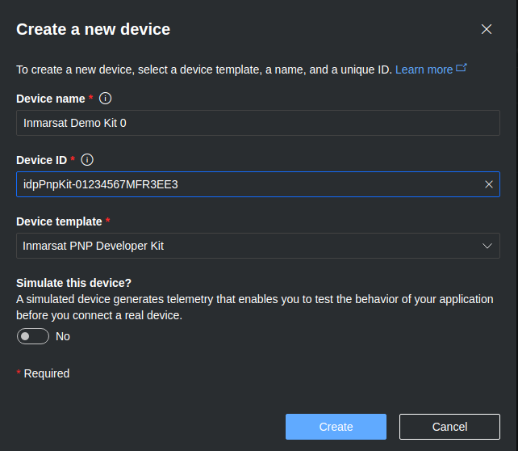

# Visualization with Azure IoT Central

Our architecture chose to make use of **IoT Central** as a hosted IoT platform 
with ready to use dashboards and integration plug-ins to other business tools.

The [Device Bridge](https://github.com/Inmarsat/isatdatapro-azure/tree/master/device-bridge.md)
uses the [IoT Central REST API](https://docs.microsoft.com/en-us/rest/api/iotcentral/)
**Device Templates** and **Devices** capabilities to correlate to device model 
proxy(s) used for satellite messaging.

## Device Templates

Periodically the Device Bridge connects to IoT Central to query available 
Device templates and push updates stored in the device bridge function app. See 
[templates](https://github.com/Inmarsat/isatdatapro-azure/tree/master/device-bridge.md#device-capability-model-templates)

## Customizing Device Templates

Prior to use, the device templates pushed by Device Bridge are intended to be 
manually configured by a *Builder* to define **Views** relevant to data 
visualization.

### Inmarsat PnP Developer Kit Template

One example is a very simple device based on Inmarsat's *Plug-N-Play* developer 
kit which uses a Raspberry Pi Zero Wireless connected to an IsatData Pro modem
to periodically send location and satellite signal strength telemetry.
Location can be displayed on a map, while signal strength can be plotted on a
chart as time series data.

The Inmarsat-defined [Device Twin Definition Language](https://github.com/Azure/opendigitaltwins-dtdl/tree/master/DTDL) template `urn:inmarsat:idp:capabilityModel:inmarsatPnpDevKit:1`
defines 3 interfaces:

* **Device Information** includes information about the Raspberry Pi as an IoT Gateway, using Microsoft's template `urn:azureiot:DeviceManagement:DeviceInformation:1`.
* **Satellite Modem** includes information about the IDP modem.
* **FieldEdge Ultralite IDP** includes information and capabilities of the Edge app that sends the telemetry data via the satellite modem.

1. Create a device Dashboard. Click **Views** and **Visualizing the device**.
    1. Set the *View name* to **`Dashboard`**.
    2. Under *Add a tile* and *Cloud property*:
        1. Select **Customer**.
        2. Click *+Cloud property* and select **FieldEdge Ultralite Hardware Model**.
        3. Click *+Cloud property* and select **Satellite Modem Model**.
        4. Click **Add tile**.
        5. Click the gear icon on the new tile and change the *Title*
        to **`Customer Hardware`** and click *Update*.
    3. Under *Add a tile* and *Property*:
        1. Select **Mobile ID**.
        2. Click *+Property* and select **Modem Manufacturer**.
        4. Click *Cloud property* and select **Satellite Modem Part Number**.
        3. Click *+Property* and select **Wakeup Period**.
        4. Click *+Property* and select **Last Message Received Time**.
        5. Click *+Property* and select **Last Modem Registration Time**.
        6. Click *+Property* and select **Satellite Region**.
        7. Click **Add tile**.
        8. Click the gear icon of the new tile and change the *Title* to
        `Satellite Modem` and click *Update*.
    4. Under *Add a tile* and *Property*:
        1. Select **FieldEdge Ultralite IDP / Location**.
        2. Click **Add tile**.
    5. Under *Add a tile* and *Telemetry*:
        1. Select **Satellite (Rx) SNR**.
        2. Click **Add tile**.
        3. Click the gear icon on the new tile.
        4. Set the **Display range** to *Past 1 week* and click *Update*.
    6. Click **Save**.

2. Create a device Configuration page. Click **Views**
then **Editing device and cloud data**:
    1. Set *Form name* to **`Configuration`**.
    2. Under *Cloud properties* select the following:
        * **Customer**
        * **FieldEdge Ultralite Hardware Model**
        * **Satellite Modem Model**
        * **Satellite Modem Part Number**
    3. Click *Add section*.
    4. Click the gear icon of the new section and change the Section title
    to `Device metadata`.
    2. Under *Properties* select the following:
        * **Reporting Interval**
        * **QoS Measurement Interval**
    3. Click *Add section*.
    4. Click the gear icon of the new section and change the Section title
    to `FieldEdge Ultralite Properties (set using Commands view)`.
    8. Under *Properties* select the following:
        * **Wakeup Period**
        * **Transmitter Mute**
    9. Click *Add section*.
    10. Click the gear icon of the new section and change the Section title
    to `Satellite Modem`.
    14. Click **Save**.

3. Create a text messaging page. Click **Views**
then **Editing device and cloud data**:
    1. Set *Form name* to **`Text Messages`**.
    2. Under *Properties* select the following:
        * **Last Mobile-Originated Text**
        * **Last Mobile-Terminated Text**
    3. Click *Add section*.
    4. Click the gear icon of the new section and change the Section title
    to `Most recent message`.
    5. Click **Save**.
    
4. Create a command page. Click **Views** then **Visualizing the device**.
    1. Set the *View name* to **`Commands`**.
    2. Under *Add a tile* and *Commands*:
        1. Select **Get Report**.
        2. Click **Add tile**.
        3. Select **Set Properties**.
        4. Click **Add tile**.
        5. Select **Ping IDP Modem**.
        6. Click **Add tile**.
        7. Select **Reset IDP Modem**.
        8. Click **Add tile**.
    3. Click **Save**.

3. Delete the (auto-generated) **About** and **Overview** Views.

4. Click **Publish**.

## Device Provisioning (Manual)

The recommended way to provision new devices is manually:

1. Click **Devices**

2. Click **New**

3. Fill in the form:
    1. **Device Name** can be something easily identifiable
    e.g. `My Developer Kit`
    2. **Device ID** must be unique containing your IDP modem serial number
    (aka Mobile ID) e.g. `idpPnpKit-01234567MFR3EE3`
    3. **Device Template** select your template
    e.g. `Inmarsat PNP Developer Kit`
    4. Click **Create**

    

## Device Auto-provisioning

By default, the 
[Device Bridge](https://github.com/Inmarsat/isatdatapro-azure/tree/master/device-bridge.md) 
automatically registers new satellite-connected devices using an IoT Central 
Shared Access Signature via the Azure IoT Hub Device Provisioning Service, 
trusting the globally unique *Mobile ID* which has been authenticated by the 
Inmarsat network and device provisioning process.

>: Note: For enhanced security, you could adopt a more explicit provisioning 
process of pre-loading approved device IDs into IoT Central.

When a *NewReturnMessage* is detected, the Device Bridge looks up all 
provisioned devices in the IoT Central instance and if none contain the Mobile 
ID it assigns a device name `idp-<mobileId>` that will appear in the Devices 
list of IoT Central with Device status *unassociated* and Device template 
*unassigned*.

A user can ***migrate*** an unassigned device to one of the available templates. 
For example, the [Inmarsat PnP Developer Kit](#Inmarsat-PnP-Developer-Kit-Template)
device template.
After a migration has been done, all subsequent messages from that device will 
be routed to the Device data model in IoT Central.

## Next Steps

Walk through the [initial set-up](setup.md)
